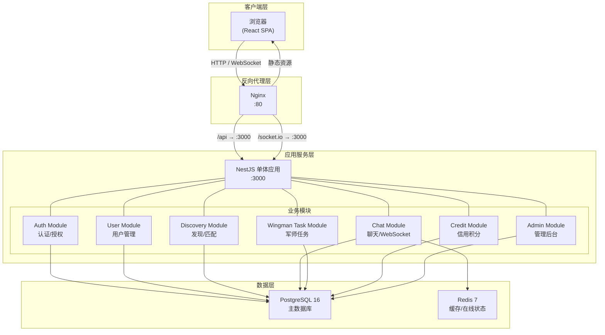
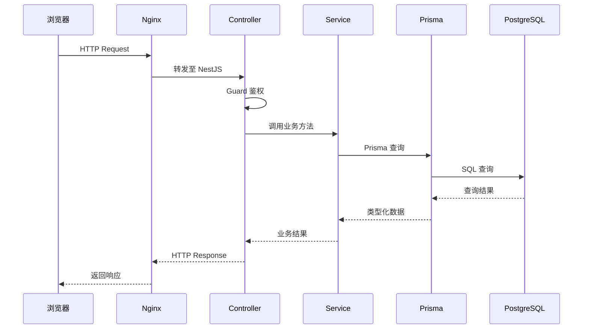
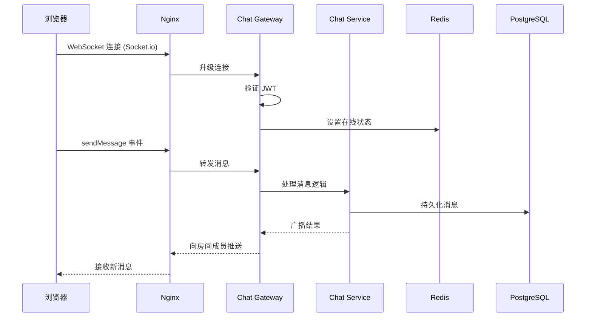
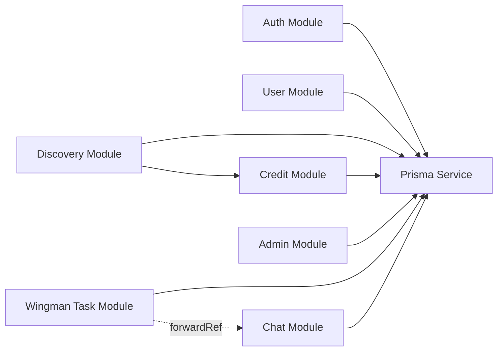
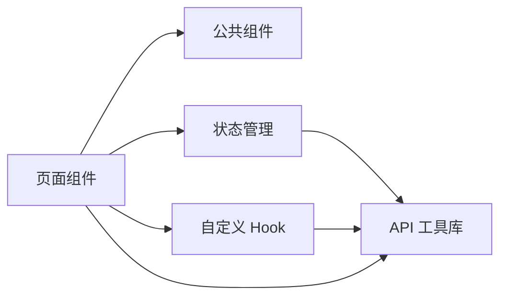
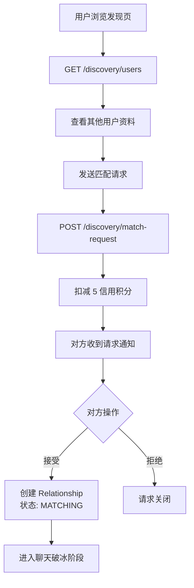
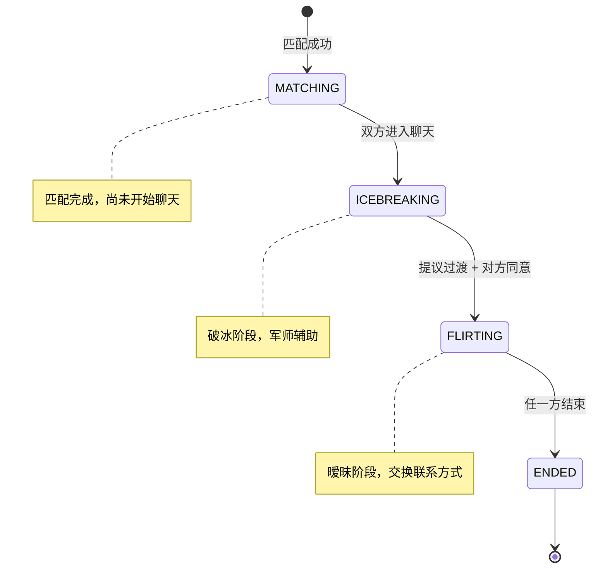

# Violet 架构设计文档
## 一、架构概览
### 1.1 系统简介
Violet 是一个校园恋爱辅助平台，核心特色是引入「军师（Wingman）」角色帮助当事人破冰和代聊。系统包含灵魂画廊（用户发现）、牵线匹配、实时聊天（三边/四边聊天室）、军师任务大厅、信用积分、管理后台等核心功能。

### 1.2 架构风格
采用 **前后端分离的单体分层架构**，后端 NestJS 应用内部按业务领域划分模块，前端为 React SPA。通过 Nginx 反向代理统一入口，静态资源和 API 请求分流处理。

### 1.3 架构总览图


### 1.4 请求处理流程
**HTTP 请求流程：**



**WebSocket 消息流程：**



## 二、模块划分说明
### 2.1 后端模块划分
| 模块 | 职责 | 核心功能 | 关键依赖 |
| --- | --- | --- | --- |
| **Auth Module** | 用户认证与授权 | 注册、登录、JWT 签发、Cookie 管理 | PrismaService |
| **User Module** | 用户信息管理 | 个人资料 CRUD、头像上传、个性卡片、军师认证、密码修改 | PrismaService |
| **Discovery Module** | 用户发现与匹配 | 用户浏览、发送/接收匹配请求、关系管理 | PrismaService, CreditModule |
| **Chat Module** | 实时聊天 | 消息收发、WebSocket 管理、房间管理、消息可见性控制、在线状态、关系生命周期 | PrismaService, Redis |
| **Wingman Task Module** | 军师任务市场 | 任务创建/浏览、军师申请/审批、任务取消 | PrismaService, ChatModule |
| **Credit Module** | 信用积分系统 | 余额查询、每日签到、积分扣减 | PrismaService |
| **Admin Module** | 管理后台 | 平台统计、用户管理、信用调整、账号启禁 | PrismaService |
| **Prisma Module** | 数据库访问 | Prisma 客户端生命周期管理、数据库连接 | PostgreSQL |


### 2.2 前端模块划分
| 模块 | 职责 | 关键文件 |
| --- | --- | --- |
| **页面组件** | 各路由页面的 UI 渲染 | `pages/*.tsx` |
| **公共组件** | 可复用的 UI 组件 | `components/*.tsx` |
| **状态管理** | 全局状态（认证、聊天） | `stores/*.ts` |
| **自定义 Hook** | 封装复用逻辑 | `hooks/*.ts` |
| **工具库** | API 封装、常量、工具函数 | `lib/*.ts` |


### 2.3 模块依赖关系图
**后端模块依赖：**



说明：

+ 所有业务模块依赖 PrismaService 进行数据库访问
+ DiscoveryModule 依赖 CreditModule 进行匹配请求时的积分扣减
+ WingmanTaskModule 与 ChatModule 存在循环依赖，通过 NestJS 的 `forwardRef` 解决
+ 虚线表示 forwardRef 循环依赖

**前端模块依赖：**



## 三、技术选型说明
| 层次 | 选择 | 选择理由 |
| --- | --- | --- |
| **前端框架** | React 19 + TypeScript | 组件化开发，生态丰富，TypeScript 提供类型安全，减少运行时错误 |
| **前端构建工具** | Vite 8 | 开发服务器启动极快，HMR 热更新迅速，构建配置简洁，相比 Webpack 大幅提升开发体验 |
| **前端样式方案** | Tailwind CSS 4 | 原子化 CSS，开发效率高，配合自定义设计系统（Violet Ethereal 色板），无需维护独立 CSS 文件 |
| **前端状态管理** | Zustand 5 | 比 Redux 轻量，API 简洁，无 boilerplate，适合中小型应用，TypeScript 支持好 |
| **前端动画** | Framer Motion + GSAP | Framer Motion 处理组件级动画（进入/退出/布局），GSAP 处理复杂时间线动画（发现页卡片堆叠），Lenis 处理平滑滚动 |
| **后端框架** | NestJS 11 | 企业级 Node.js 框架，模块化设计天然支持业务边界划分，内置 WebSocket、Guard、Interceptor 等基础设施，TypeScript 原生支持 |
| **ORM** | Prisma 6 | 声明式 Schema 定义，类型安全的数据库访问，自动生成迁移，开发体验优于 TypeORM，与 TypeScript 配合极佳 |
| **数据库** | PostgreSQL 16 | 功能完善的关系型数据库，支持 JSON 字段、全文搜索、复杂查询，适合校园级应用的数据规模和复杂度 |
| **缓存/在线状态** | Redis 7 | 高性能内存数据库，用于在线状态管理、WebSocket 房间成员追踪、限流等场景，ioredis 客户端稳定可靠 |
| **实时通信** | Socket.io 4 | 成熟的 WebSocket 库，自动降级为轮询，房间管理、广播、事件机制完善，前后端 API 一致 |
| **认证方案** | JWT + Cookie | JWT 无状态验证减少数据库查询，HttpOnly Cookie 存储 token 防止 XSS 窃取，7 天有效期平衡安全与体验 |
| **密码加密** | bcrypt | 业界标准的密码哈希算法，自带盐值，计算成本可调，防止彩虹表攻击 |
| **文件上传** | Multer (NestJS 内置) | 轻量级文件上传中间件，支持磁盘存储，适合头像和个性卡片图片上传，无需引入对象存储服务 |
| **CI/CD** | GitHub Actions | 与 GitHub 仓库无缝集成，自动化构建、测试、部署流水线，免费额度充足 |
| **进程管理** | PM2 6 | Node.js 生产环境进程管理器，支持自动重启、日志管理、监控，配置简单 |
| **反向代理** | Nginx 1.24 | 高性能 Web 服务器，处理静态资源服务和 API 反向代理，支持 WebSocket 代理，配置成熟 |
| **部署方式** | 阿里云 ECS + Docker-less | 单服务器部署，无需容器编排，降低运维复杂度。Nginx 直接服务前端静态文件 + 反向代理后端进程 |


## 四、数据流设计
### 4.1 核心业务数据流
**用户匹配流程：**



**聊天生命周期：**



### 4.2 实时通信架构
```plain
┌───────────────────────────────────────────────────────┐
│                    Socket.io 架构                        │
├───────────────────────────────────────────────────────┤
│                                                         │
│  Client A ←──┐                                         │
│              │     ┌─────────────┐     ┌─────────┐    │
│  Client B ←──┼────→│  Chat Gateway │←──→│  Redis  │    │
│              │     │  (NestJS)     │     │ (Presence)│   │
│  军师     ←──┘     └──────┬──────┘     └─────────┘    │
│                           │                             │
│                    ┌──────┴──────┐                     │
│                    │ Chat Service │                     │
│                    │ Room Service │                     │
│                    │ Lifecycle Svc│                     │
│                    └─────────────┘                     │
└───────────────────────────────────────────────────────┘
```

## 五、部署架构
```plain
┌──────────────────────────────────────────┐
│        阿里云 ECS (Ubuntu 24.04)            │
│        4 vCPU / 8 GiB / 40 GiB             │
│                                            │
│  ┌──────────────────────────────────────┐ │
│  │           Nginx (:80)                 │ │
│  │  /            → 前端静态文件 (dist/)     │ │
│  │  /api/*      → localhost:3000         │ │
│  │  /socket.io/*→ localhost:3000         │ │
│  └──────────┬───────────────────────────┘ │
│             │                              │
│  ┌──────────┴───────────────────────────┐ │
│  │     NestJS Application (PM2)         │ │
│  │           localhost:3000              │ │
│  └──────┬──────────────┬────────────────┘ │
│         │              │                   │
│  ┌──────┴──────┐ ┌─────┴──────┐          │
│  │ PostgreSQL  │ │   Redis 7  │          │
│  │    :5432    │ │   :6379    │          │
│  └─────────────┘ └────────────┘          │
└──────────────────────────────────────────┘
```

## 六、安全性设计
| 安全措施 | 实现方式 |
| --- | --- |
| 密码安全 | bcrypt 哈希存储，不存明文 |
| 认证机制 | JWT + HttpOnly Cookie，防止 XSS 窃取 token |
| 邮箱验证 | 注册限制 @smail.nju.edu.cn 域名 |
| 权限控制 | JwtAuthGuard（全局）、AdminGuard（管理模块） |
| WebSocket 认证 | 连接时验证 JWT，无效则断开 |
| 输入验证 | class-validator DTO 校验，Prisma 参数化查询防 SQL 注入 |
| 信用安全 | 原子化积分扣减操作，防止并发导致超额消费 |
| CORS | 配置允许的请求来源 |

