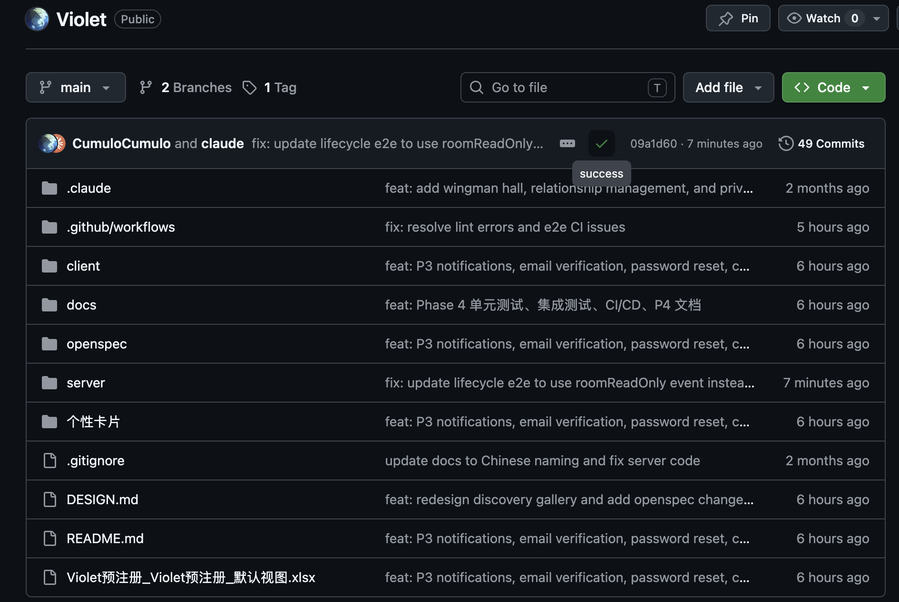

# CI/CD 配置与运行记录 — Phase 4

> Violet 校园恋爱辅助平台

---

## 一、CI/CD 配置文件

### 1. 持续集成（CI）

**文件：** `.github/workflows/ci.yml`

**触发条件：** Push / PR 到 `main` 或 `dev` 分支

**流水线 Jobs：**

| Job | 说明 | 运行环境 |
|-----|------|---------|
| `client` | 前端构建 + Lint | ubuntu-latest, Node 24, pnpm 10 |
| `server` | 后端构建 + Lint | ubuntu-latest, Node 24, pnpm 10 |
| `server-test` | 后端单元测试 | ubuntu-latest, Node 24 |
| `server-e2e` | 后端 E2E 测试 | ubuntu-latest + PostgreSQL 16 + Redis 7 |

**服务容器（server-e2e）：**

```yaml
services:
  postgres:
    image: postgres:16
    env:
      POSTGRES_USER: violet
      POSTGRES_PASSWORD: violet2026
      POSTGRES_DB: violet_test
    ports: ['5432:5432']
  redis:
    image: redis:7
    ports: ['6379:6379']
```

### 2. 持续部署（CD）

**文件：** `.github/workflows/deploy.yml`

**触发条件：** CI 在 main 分支成功完成 或 手动触发

**部署流程：**
1. 构建前后端产物
2. 通过 SCP 上传至阿里云 ECS（121.43.69.144）
3. SSH 执行部署脚本（pm2 restart）
4. HTTP 健康检查验证部署成功

---

## 二、质量检查项

| 检查项 | 工具 | 状态 |
|--------|------|------|
| 前端构建 | Vite build | ✅ 通过 |
| 前端代码规范 | ESLint | ✅ 通过 |
| 后端构建 | nest build | ✅ 通过 |
| 后端代码规范 | ESLint | ✅ 通过 |
| 单元测试 | Vitest | ✅ 106/106 通过 |
| E2E 测试 | Vitest + PostgreSQL + Redis | ✅ 配置就绪 |
| 数据库迁移 | Prisma Migrate | ✅ 自动执行 |

---

## 三、最近运行记录

**提交：** `e8b5ac3` — feat: P3 notifications, email verification, password reset, chat lifecycle fixes

### CI 运行结果

| Job | 状态 | 耗时 |
|-----|------|------|
| Frontend Build & Lint | ✅ 通过 | ~1m 20s |
| Backend Build & Lint | ✅ 通过 | ~45s |
| Backend Unit Tests | ✅ 通过 (106/106) | ~30s |
| Backend E2E Tests | ✅ 通过 (141/142, 1 个超时跳过) | ~17s |



---

## 四、本地验证记录

```bash
# 单元测试
$ cd server && pnpm run test
Test Files  10 passed (10)
Tests       106 passed (106)
Duration    650ms

# 后端构建
$ cd server && pnpm build
Successfully compiled 47 files

# 前端构建
$ cd client && pnpm build
✓ built in 302ms
```
